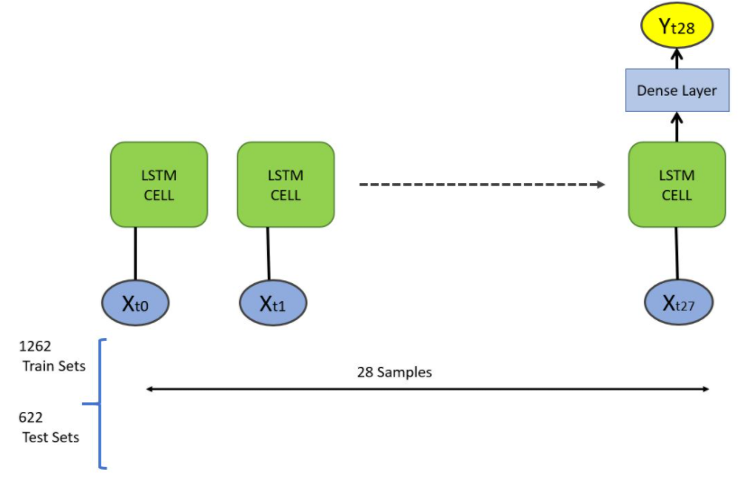

# Kaggle_Jane-Street_Competetion-Review

## References

1. EDA

   * [Jane Street: EDA of day 0 and feature importance](https://www.kaggle.com/carlmcbrideellis/jane-street-eda-of-day-0-and-feature-importance)

   * [Jane_street_Extensive_EDA & PCA starter 📊⚡](https://www.kaggle.com/muhammadmelsherbini/jane-street-extensive-eda-pca-starter)

   * [EDA / A Quant's Prespective](https://www.kaggle.com/hamzashabbirbhatti/eda-a-quant-s-prespective)

   * [NaN values depending on Time of Day](https://www.kaggle.com/tomwarrens/nan-values-depending-on-time-of-day)

   * [Reduce Memory Usage by 75%](https://www.kaggle.com/sbunzini/reduce-memory-usage-by-75)

2. FE

   * [Optimise Speed of Filling-NaN Function](https://www.kaggle.com/gogo827jz/optimise-speed-of-filling-nan-function)

   * [Features Hierarchical Clustering](https://www.kaggle.com/apolitano20/jane-street-features-hierarchical-clustering)

   * [[github\] (pyRMT) Randomized Matrix Theory Python Code](https://github.com/GGiecold/pyRMT)

   * [🏃 Running Algos 🏃 FE for fast inference](https://www.kaggle.com/lucasmorin/running-algos-fe-for-fast-inference)

3. LSTM

   * [Learning Pytorch LSTM Deep Learning with M5 Data](https://www.kaggle.com/omershect/learning-pytorch-lstm-deep-learning-with-m5-data)

   * [LSTM-Baseline-Pytorch](https://www.kaggle.com/backtracking/lstm-baseline-pytorch)

4. Resnet

   * [CNN 주요 모델들](https://ratsgo.github.io/deep%20learning/2017/10/09/CNNs/)

   * [torchvision.models.resnet](https://github.com/pytorch/vision/blob/17e1ec4e5b77a7df011b242fd18623c912ed14b3/torchvision/models/resnet.py#L26)

   * [CIFAR-10 정복 시리즈 1: ResNet](https://dnddnjs.github.io/cifar10/2018/10/09/resnet/)
   * [Pytorch-embeddingsNN + Resnet + Tensorflow](https://www.kaggle.com/sapthrishi007/pytorch-embeddingsnn-resnet-tensorflow)

5. 1d-cnn

   * [How to Use Convolutional Neural Networks for Time Series Classification](https://medium.com/@Rehan_Sayyad/how-to-use-convolutional-neural-networks-for-time-series-classification-80575131a474)
   * [1D Convolutional Neural Networks and Applications: A Survey](https://arxiv.org/abs/1905.03554)
   * [1dcnn-pytorch-jstreet](https://www.kaggle.com/pyoungkangkim/1dcnn-pytorch-jstreet)

6. Embeded-NN
   * [Pytorch-embeddingsNN + Resnet + Tensorflow](https://www.kaggle.com/sapthrishi007/pytorch-embeddingsnn-resnet-tensorflow)
7. Optuna
   * [pytorch-optuna example](https://github.com/FernandoLpz/Optuna-Sklearn-PyTorch/blob/master/optuna_pytorch.py)
   * [Hyperparameter tuning in PyTorch using Optuna](https://titanwolf.org/Network/Articles/Article?AID=172eb24c-217d-4c4e-9623-e0e68349f4e2#gsc.tab=0)

## Models

1. LSTM (LB: 1892.247)

   Representative way of RNN for timeseries data

   

   * Limitation

     Submission seems like 'bottleneck' what some kagglers said.

     The test data creates per one opportunity.

     So, we need to fill datas until those have proper data points(= time sequence)

2. Resnet-1dcnn (LB: 6795.438; before tuning; random CV)

   https://blog.goodaudience.com/introduction-to-1d-convolutional-neural-networks-in-keras-for-time-sequences-3a7ff801a2cf

   ※ parameter

   | layers  | hidden_layers | f_act | dropout | optimizer | learning_rate | weight_decay |
| ------- | ------------- | ----- | ------- | --------- | ------------- | ------------ |
   | [5,5,5] | [512,128]     | ReLU  | 0.2     | Adam      | 1e-3          | 1e-5         |

    * Overall Shape btw 1d-cnn and 2d-cnn

    

    * Overall 2d-cnn architecture

    

    * Overall 1d-cnn architecture

    
   
    * Resnet
   
    
   
    

3. embedding-nn (LB: 4830.862; before tuning; random CV)

   https://medium.com/@hari4om/word-embedding-d816f643140

   ※ Tuned-parameter
   
   |Selected|Mean AUC|Mean Utility|Fold1-AUC|Fold1-Utility| Fold2-AUC | Fold2-Utility | Fold3-AUC | Fold3-Utility |hidden-layer|n_layers|decreasing|f_act|dropout|embed_dim|optimizer|learning_rate|weight_decay|
   |-----|-----|-----|------|------|------|------|------|------|------|------|------|------|------|------|------|------|------|
   | False    | 0.5311   | 6058.2003    | 0.5323    | 6253.5662     | 0.5307    | 5494.9595     |0.5303|6426.0753|256| 3        | False      |SiLU|0.23308511537027937|10|Adam|0.000663767918321238|2.6504094565959894e-07|
   |True|0.5326|6055.6161|0.5322|5822.0162|0.5320|5811.6806|0.5338|6533.1516|256|4|True|SiLU|0.17971171427796284|5|Adam|2.9521544108896628e-05|5.679142529741758e-05|
   
   * embedding
   
     
   
4. Resnet-dense (LB: 3100.659; before tuning; Stratified Group CV)

   ※ Tuned-parameter

   | Selected | Mean AUC | Mean Utility | Fold1-AUC | Fold1-Utility | Fold2-AUC | Fold2-Utility | Fold3-AUC | Fold3-Utility | hidden-layer | n_layers | decreasing | f_act     | dropout             | embed_dim | optimizer | learning_rate          | weight_decay           |
   | -------- | -------- | ------------ | --------- | ------------- | --------- | ------------- | --------- | ------------- | ------------ | -------- | ---------- | --------- | ------------------- | --------- | --------- | ---------------------- | ---------------------- |
   | False    | 0.5309   | 6162.2528    | 0.5299    | 6433.2630     | 0.5313    | 5603.7364     | 0.5315    | 6449.7590     | 512          | 3        | True       | LeakyReLU | 0.34213845887711536 | 10        | Adam      | 0.0009437366580626903  | 1.0288953711004482e-08 |
   | True     |          |              | 0.5301    | 6495.6230     | 0.5319    | 6123.3656     | 0         |               | 256          | 2        | False      | SiLU      | 0.49627361377205387 | 0         | Adam      | 1.3352033297894747e-05 | 8.62843672831598e-08   |

## Reviewing points

1. Understanding about Time-Series Dataset

   * Creating Dataset for RNN
   * CV technique for Time-Series

2. Neural Net optimization by Optuna

   * understand how to tune pytorch nn model by optuna (make automation by parameter)

   * Optimization Criterion was wrong

     (Overall NN model tunning -> Detail element tunning(i.e. optimizer, learning_rate, weight_decaying, hiden_layer, activation_function etc...))